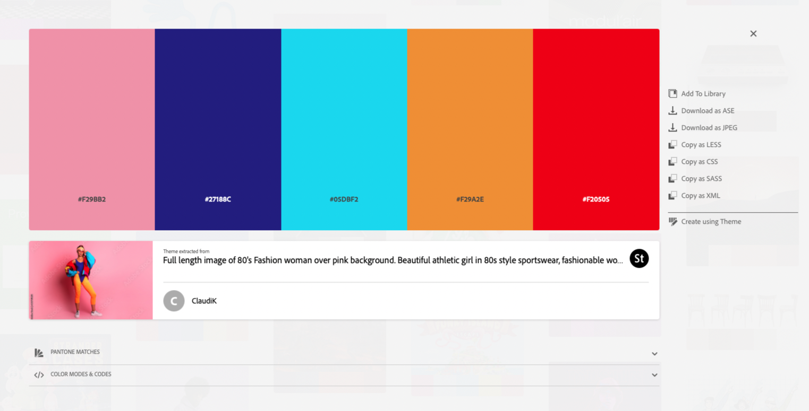

# Assignment 9 ReadMe Questions and Answers

## 1. Describe the difference between the universal, element, class, and id selector types. When might you choose one over the other to style content?

### Difference in selector types:
* Universal Selector: styles every element on the page.  It is defined as a (*), the * means all.
* Element Selector: selects certain types of elements, but needs a keyword to declare that style.
* Class Selector: selects elements that have similar functions.  Must have a dot(.) and a name attached to them.
* ID Selector: defines specific rules for unique IDs and is defined with a (#).

### Reasons for choosing selector types:
* The universal selector makes your selectors easier to read.
* The element selector reduces the scope of an established rule and only applies to that element.
* The class selector applies multiple classes to an element to target individual classes better.  It builds up components that can be combined in different ways.
* ID selectors overrule most other selectors, but can only be used once per page.

## 2. Briefly discuss your color palette, including the 3 colors you chose. List their color names, RGB values, or hex codes.

I always use [Adobe Color](https://color.adobe.com/search?q=80%27s#), because I can put in key words and it gives me a matching color palette with all the appropriate hex codes.

## 3. Free Response: Please discuss any challenges you had this week and how you overcame them.
It took me forever to figure out how the center certain items!  I am not sure why I can't just input "center" for the command, but I did figure it out.  I felt really good about adding that automatic slideshow and it actually working correctly.  I found the code in W3 schools and edited it to fit the theme I had for my page.
